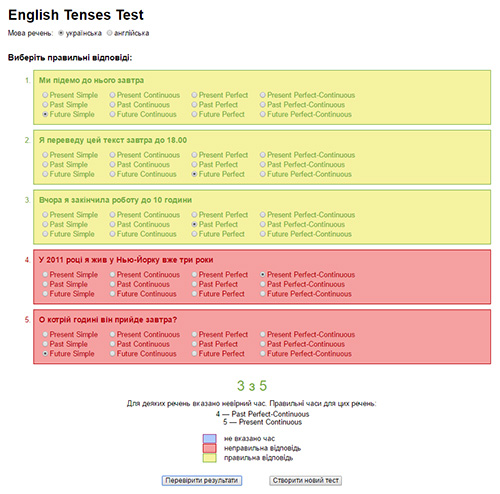

# Mixed English verb tenses quiz with answers

You can test your knowledge of English verb tenses and possibly find out what you need to study.

First of all you have to select the language of questions — English or Ukrainian. Each test contains just 5 questions. Choose an answer to complete each question. After finishing a test, you can review your answers and see correct answers.
